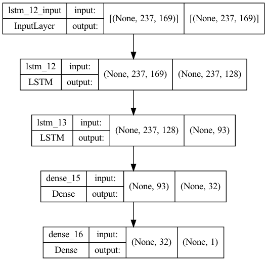
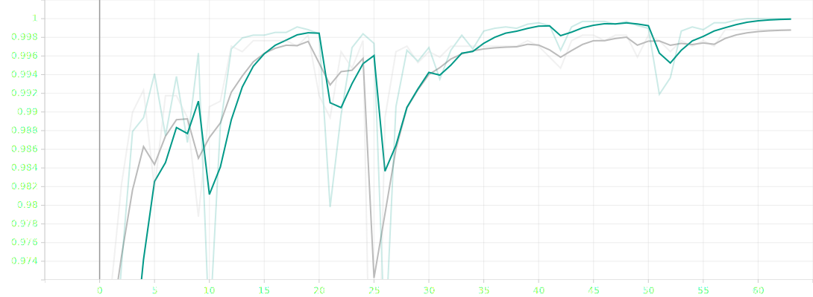
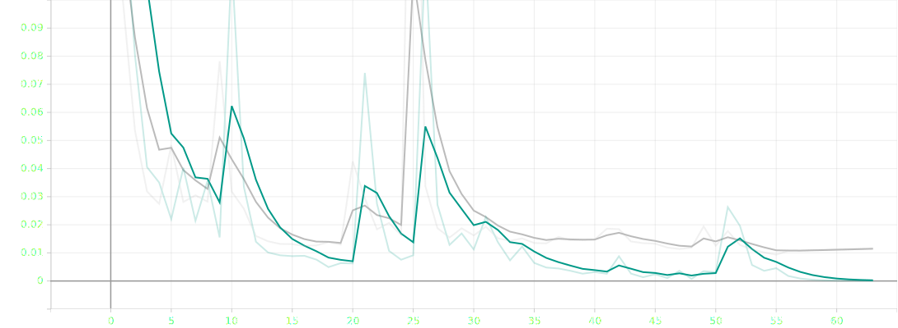

<h1 align="center"><b>Real Time Gender Classifier</b></h1>

#### Trained and developed the binary classification model which is able to classifies the gender (Male-Female) of human module using Long-Short Term Memory Neural Network with hyper parameter tunnig with the input features Root Mean Squared Energy, MFCCs, Mel-Spectrogram with achiving the classification accuracy of 99% on Validation dataset.

## Overview
- In this project I have used 2 different datasets which are the RAVDESS and the TESS dataset.
- Used 8480 total number of audio samples to train the model.
- Build the neural network with the RElU Activation function for hidden layers
- Used Sigmoid Activation function for output layer
- Define the batch size of 256 with Epoch 60
- Achived Train-Test Accuracy of 99-99 %

## Working of Real Time Detection 
- For real time detection it continuously listen for the audio using microphone and evey 2.6 seconds it perform classification on that clip of audio and gives the predicted gender.

## How to run
- To train the model use Gender_Classifier_Model_Training.ipynb Jupyter Notebook File
- To start real time detection use Real_Time_Gender_Classifier_By_Voice.ipynb Jupyter Notebook File

## Screenshots

### Neural Network Architecher

### Performance Graph
#### Accuracy Graph

#### Loss Graph

### Confusion Matrix

### Main Interface

